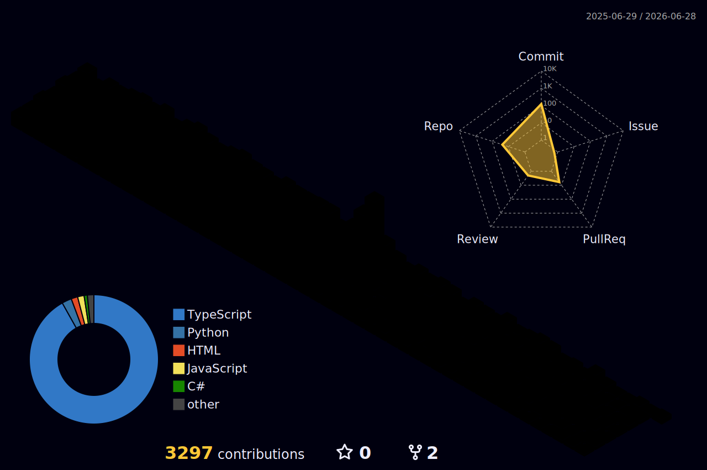

<div align="center">


<br />


</div>

---

<div align="center">

## 👋 Hey, I’m Bereket

### I build scalable web and mobile products with clean architecture, strong UX, and production-ready performance.

I’m a **Full-Stack Software Engineer** focused on building polished products across **SaaS, marketplaces, fintech, healthtech, edtech, and platform systems**.  
I enjoy turning ambitious ideas into reliable software that feels fast, clear, and useful in the real world.

</div>

---

## 🌐 Connect With Me

<div align="center">

<a href="https://www.berekettadesse.com/">
  
</a>
<a href="https://www.linkedin.com/in/berekettadesse/">
  
</a>
<a href="https://github.com/berek47">
  
</a>
<a href="https://leetcode.com/u/berek47/">
  
</a>

</div>

---

## 🚀 What I Do


- ⚡ Build fast, responsive, production-ready frontend applications  
- 🧠 Design scalable backend APIs and database-driven systems  
- 🔐 Implement authentication, authorization, JWT, OAuth, and secure workflows  
- 📊 Create dashboards, SaaS platforms, marketplace systems, and admin panels  
- 🧩 Connect product, design, and engineering to ship real features  
- 🛠️ Optimize performance, reliability, and user experience  

<br clear="right"/>

---

## 🧰 Animated Tech Stack

<div align="center">

### Languages


<br />


### Frontend & UI


<br />


### Backend & Frameworks


### Databases & Storage


### Cloud, DevOps & Tools


<br />


</div>

---

## 🏆 GitHub Trophies

<div align="center">


</div>

---

## 📊 GitHub Analytics

<div align="center">


</div>

<div align="center">


</div>

---

## 🧠 LeetCode Progress

<div align="center">


</div>

---

## 🧩 Featured Experience

<table>
  <tr>
    <td width="50%">
      <h3>💸 Dime</h3>
      <p>Built fintech/remittance product features including OTP, Google OAuth, HTTP-only JWT auth, FX rates, Redis caching, and idempotent APIs.</p>
    </td>
    <td width="50%">
      <h3>✈️ TripApp</h3>
      <p>Built marketplace features, Stripe Checkout, webhooks, real-time trip tracking, and optimized dashboard performance.</p>
    </td>
  </tr>
  <tr>
    <td width="50%">
      <h3>🎓 ESSS Learning</h3>
      <p>Developed an e-learning platform with role-based access control, JWT authentication, and optimized frontend performance.</p>
    </td>
    <td width="50%">
      <h3>📈 Finsight</h3>
      <p>Built a full-stack financial insight platform using Next.js, FastAPI, PostgreSQL, and TailwindCSS.</p>
    </td>
  </tr>
</table>

---

## 🕹️ 3D Contribution Graph

> This section will start working after you add the GitHub Action below.

<div align="center">



</div>

---

## 🐍 Contribution Snake

> This section will also start working after you add the GitHub Action below.

<div align="center">


</div>

---

## 📈 Activity Graph

<div align="center">


</div>

---

## ⚡ Current Focus

```ts
const bereket = {
  role: "Full-Stack Software Engineer",

  focus: [
    "SaaS",
    "Marketplaces",
    "HealthTech",
    "EdTech",
    "FinTech",
    "Admin Dashboards",
    "Production-Ready Platforms"
  ],

  languages: [
    "JavaScript",
    "TypeScript",
    "Python",
    "Go",
    "C",
    "C++",
    "C#",
    "PHP",
    "HTML",
    "CSS",
    "SQL"
  ],

  frontend: [
    "React",
    "Next.js",
    "Vue.js",
    "TypeScript",
    "TailwindCSS",
    "Redux",
    "Three.js",
    "WebGL",
    "Flutter",
    "Figma"
  ],

  backend: [
    "FastAPI",
    "Node.js",
    "Express.js",
    "NestJS",
    ".NET",
    "Laravel"
  ],

  databases: [
    "PostgreSQL",
    "MongoDB",
    "MySQL",
    "Redis",
    "Supabase",
    "Firebase"
  ],

  cloudAndDevOps: [
    "Docker",
    "Kubernetes",
    "AWS",
    "GCP",
    "Azure",
    "GitHub Actions",
    "Git",
    "GitHub",
    "Jira",
    "Pytest"
  ],

  mindset: [
    "Clean Architecture",
    "Performance",
    "UX",
    "Scalability",
    "Security",
    "Maintainability"
  ],

  portfolio: "https://www.berekettadesse.com/"
};
```
